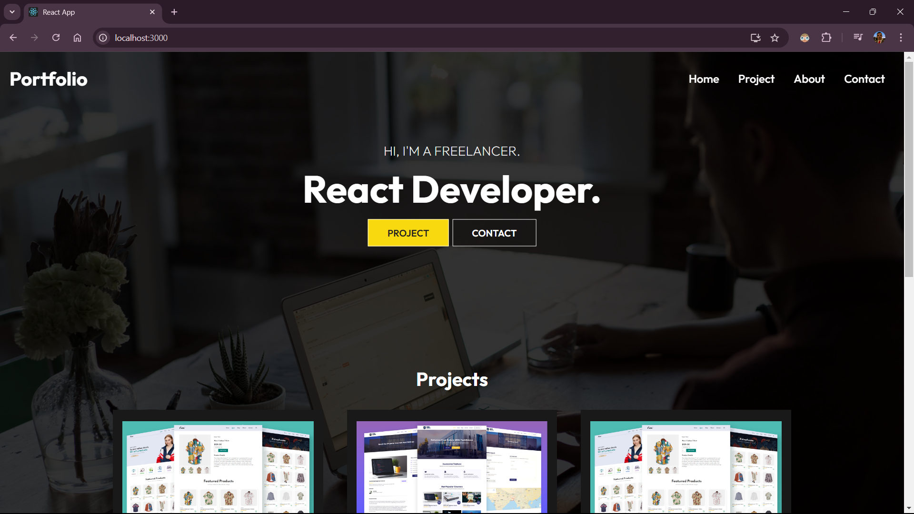
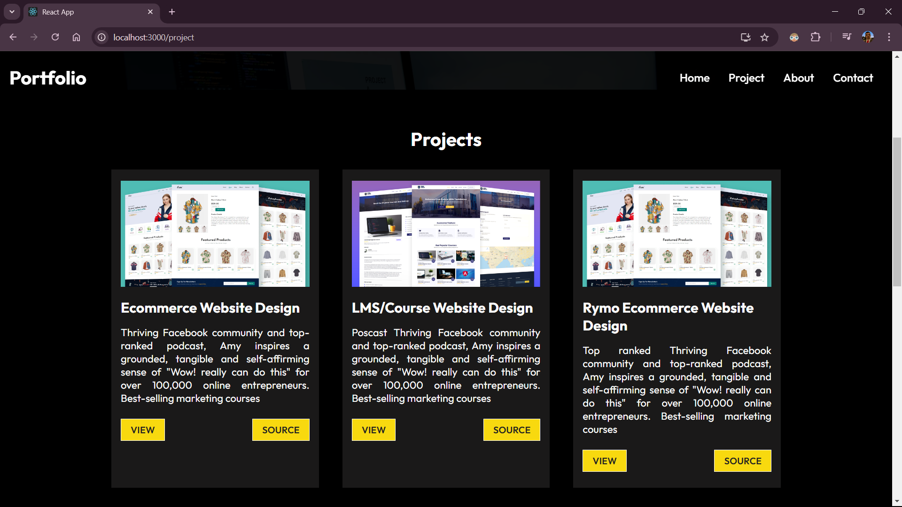
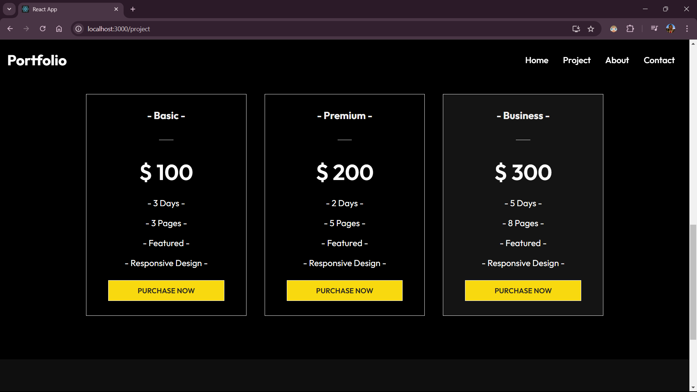
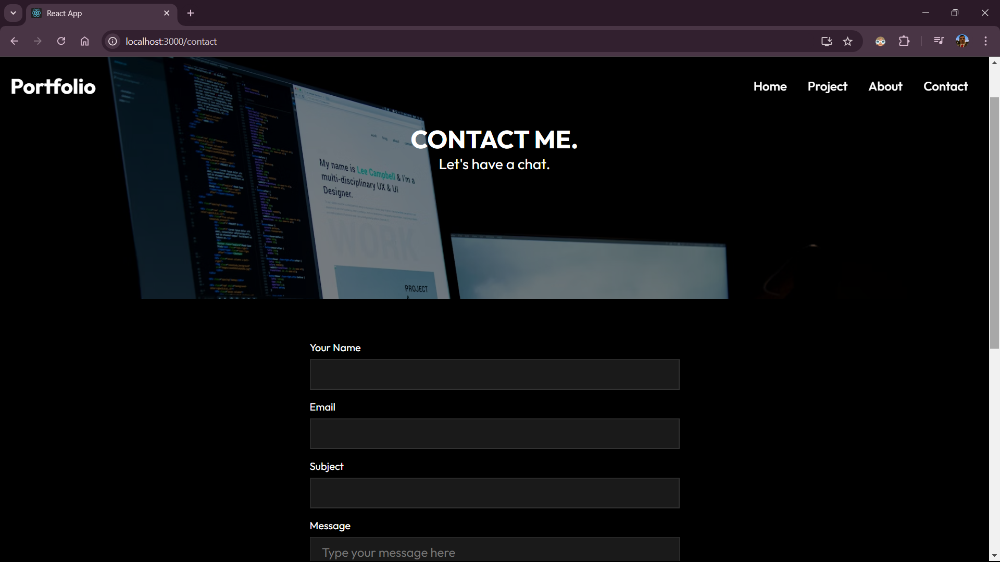

# Personal Portfolio

This is a practice personal portfolio website showcasing my skills, projects, and experiences as a Software Engineering student and front-end developer. The portfolio highlights my technical abilities and provides visitors with a comprehensive overview of my work.


## About the Project

This project serves as a digital resume and portfolio to demonstrate my skills in front-end development, particularly in HTML, CSS, JavaScript, ReactJS, and WordPress. The website is designed to be responsive, ensuring compatibility with various devices, and includes interactive elements to engage visitors.

## Tech Stack

- **Frontend:** ReactJS
- **Styling:** CSS
- **Icons:** React Icons
- **State Management:** React Hooks (useState)


## Installation

1. Clone the repository:
   ```bash
   https://github.com/promishgrg98/personal-portfolio.git
2. **Navigate to the project directory:**
   ```bash
   cd personal-portfolio
3. **Install the dependencies:**
   ```bash
   npm install
4. **Start the development server:**
   ```bash
   npm start
The application will be available at http://localhost:3000.

## Screenshots






